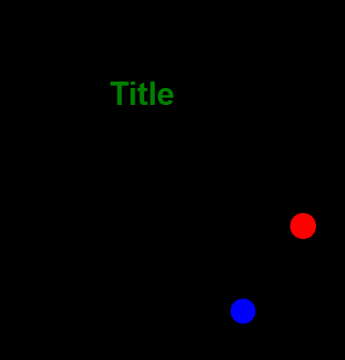

<h1>Projet de Compteur de Clics avec Animation</h1>

<h2>Description</h2>

Ce projet est une petite application web interactive qui permet d'incrémenter un compteur à chaque clic sur l'un des deux boutons animés : un bouton rouge et un bouton bleu. Le compteur est affiché dans le titre de la page, et il change dynamiquement en fonction des interactions de l'utilisateur. De plus, après un délai de 10 secondes, les boutons disparaissent automatiquement.

<h2>Fonctionnalités</h2>
<ul>
  <li><strong>Compteur dynamique :</strong> Le compteur s'incrémente à chaque clic sur les boutons, et l'affichage du titre est mis à jour en temps réel.</li>
  <li><strong>Animation des boutons :</strong> Les boutons rouge et bleu se déplacent selon une animation CSS définie avec <code>@keyframes</code>.</li>
  <li><strong>Suppression automatique des boutons :</strong> Les boutons sont supprimés du DOM après 10 secondes et un message est affiché dans la console indiquant la fin du chrono.</li>
</ul>

<h2>Technologies utilisées</h2>
<ul>
  <li><strong>HTML</strong> : Pour la structure de la page.</li>
  <li><strong>CSS</strong> : Pour l'animation des boutons et la mise en page.</li>
  <li><strong>JavaScript</strong> : Pour la logique d'incrémentation du compteur, la gestion des événements de clic, et la suppression des boutons après un délai.</li>
</ul>

<h2>Aperçu</h2>

<h2>Installation</h2>
<ol>
  <li>Clonez ou téléchargez ce dépôt sur votre machine :
    <pre><code>git clone https://github.com/votre-utilisateur/nom-du-repo.git</code></pre>
  </li>
  <li>Ouvrez le fichier <code>index.html</code> dans votre navigateur pour visualiser le projet.</li>
</ol>

<h2>Utilisation</h2>
<ol>
  <li>Ouvrez la page dans votre navigateur.</li>
  <li>Cliquez sur les boutons rouge et bleu pour incrémenter le compteur.</li>
  <li>Observez l'animation des boutons qui se déplacent sur la page.</li>
  <li>Après 10 secondes, les boutons disparaîtront et un message s'affichera dans la console indiquant la fin du chrono.</li>
</ol>

<h2>Structure du Projet</h2>
<pre><code>
.
├── index.html          # Structure HTML de la page
├── style.css           # Fichier de style pour la mise en page et les animations
├── script.js           # Fichier JavaScript pour la logique du compteur et des événements
└── assets/
    └── preview.png     # Capture d'écran pour l'aperçu du projet (à ajouter si nécessaire)
</code></pre>

<h2>Code Exemple</h2>

<h3>HTML</h3>
<pre><code>&lt;!DOCTYPE html&gt;
&lt;html lang="fr"&gt;
  &lt;head&gt;
    &lt;meta charset="UTF-8" /&gt;
    &lt;meta name="viewport" content="width=device-width, initial-scale=1.0" /&gt;
    &lt;link rel="stylesheet" href="style.css" /&gt;
    &lt;title&gt;Modèle&lt;/title&gt;
  &lt;/head&gt;
  &lt;body&gt;
    &lt;div class="container"&gt;
      &lt;h1 id="titre"&gt;Title&lt;/h1&gt;
      &lt;div id="btn-red"&gt;&lt;/div&gt;
      &lt;div id="btn-blue"&gt;&lt;/div&gt;
    &lt;/div&gt;
    &lt;script src="script.js"&gt;&lt;/script&gt;
  &lt;/body&gt;
&lt;/html&gt;
</code></pre>

<h3>CSS</h3>
<pre><code>* {
  margin: 0;
  padding: 0;
  box-sizing: border-box;
  text-decoration: none;
}

html {
font-size: 62.5%;
}

body {
font-size: 2rem;
font-family: Arial, Helvetica, sans-serif;
color: white;
}

.container {
height: 100vh;
display: flex;
justify-content: center;
flex-direction: column;
align-items: center;
background-color: black;
}

#btn-red {
background-color: red;
height: 3.125rem;
width: 3.125rem;
border-radius: 50%;
position: relative;
animation-name: rouge;
animation-duration: 2s;
animation-iteration-count: infinite;
}

@keyframes rouge {
0% {
left: 0px;
top: 0px;
}
25% {
left: 200px;
top: 0px;
}
50% {
left: 200px;
top: 200px;
}
75% {
left: 0px;
top: 200px;
}
100% {
left: 0px;
top: 0px;
}
}

#btn-blue {
background-color: blue;
height: 3.125rem;
width: 3.125rem;
border-radius: 50%;
position: relative;
animation-name: bleu;
animation-duration: 2s;
animation-iteration-count: infinite;
}

@keyframes bleu {
0% {
left: 0px;
top: 0px;
}
25% {
left: 0px;
top: 200px;
}
50% {
left: 200px;
top: 200px;
}
75% {
left: 200px;
top: 0px;
}
100% {
left: 0px;
top: 0px;
}
}
</code></pre>

<h3>JavaScript</h3>
<pre><code>const red = document.getElementById("btn-red");
const blue = document.getElementById("btn-blue");
let titre = document.getElementById("titre");

titre.style.color = "green";

let compteur = 1;

red.addEventListener("click", function () {
add();
console.log("Clique sur le bouton rouge");
title();
});

blue.addEventListener("click", function () {
add();
console.log("Clique sur le bouton bleu");
title();
});

function add() {
compteur = compteur + 1;
console.log("nouveau compteur:", compteur);
}

function title() {
titre.innerText = compteur;
}

setTimeout(function () {
red.remove();
blue.remove();
console.log("fin du chrono");
}, 10000);
</code></pre>

<h2>Auteur</h2>

<strong>Nom</strong> : [Votre nom] 
<strong>Email</strong> : [Votre email] 
<strong>GitHub</strong> : <a href="https://github.com/NICOLASR44">Votre profil GitHub</a>

